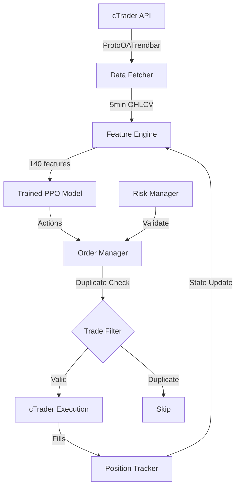

# RL Trading Bot - Product Requirements Document (PRD)

## Executive Summary

Build a reinforcement learning-based trading bot using PPO algorithm to trade 5 assets (EURUSD, GBPUSD, USDJPY, USDCHF, XAUUSD) on 5-minute timeframes. The system prioritizes consistent profitability with intelligent stop-loss and take-profit management, targeting profit factor as the primary success metric.

---

## 1. System Overview

### 1.1 Objectives
- **Primary Goal**: Generate consistent profits through automated trading
- **Key Metric**: Profit Factor (gross profit / gross loss)
- **Trading Style**: Intraday scalping/swing on 5-minute candles
- **Deployment**: Live trading via cTrader after backtesting validation

### 1.2 Asset Universe
| Asset | Type | Primary Focus | Leverage Range |
|-------|------|---------------|----------------|
| EURUSD | Forex | ✅ Major Focus | 1:200, 1:500, 1:100 |
| GBPUSD | Forex | Secondary | 1:200, 1:500, 1:100 |
| USDJPY | Forex | Secondary | 1:200, 1:500, 1:100 |
| USDCHF | Forex | Secondary | 1:200, 1:500, 1:100 |
| XAUUSD (Gold) | Commodity | Secondary | 1:200, 1:500, 1:100 |

### 1.3 Technology Stack
- **RL Framework**: Stable-Baselines3 (PPO)
- **Training Platform**: Kaggle (primary), Google Colab (light work)
- **Data Source**: cTrader API (ProtoOATrendbar)
- **Execution**: cTrader API (<200ms latency)

---

## 2. Trading Environment Specifications

### 2.1 Timeframe & Data
- **Candle Interval**: 5 minutes
- **Historical Data**: 2016 - 2024
  - Training: 2016-2023 (8 years)
  - Validation: 2024 (1 year)
  - Testing: 2025 (hold-out for backtesting)
- **Data Source**: ProtoOATrendbar messages (includes OHLCV)

### 2.2 Portfolio Configuration

**Dynamic Randomization (Per Episode)**:
- **Starting Capital**: Randomly selected from [$100, $1,000, $10,000]
- **Leverage**: Randomly selected from [1:200, 1:500, 1:100] for all pairs.

**Risk Parameters**:
- **Max Position Size**: 50% of equity per asset
- **Max Total Exposure**: 60% of equity across all assets
- **Max Portfolio Risk**: 50% of equity
- **Drawdown Threshold**: 25% (triggers massive penalty)

### 2.3 Transaction Costs
- **Spread**: Asset-specific (realistic cTrader spreads)
- **Commission**: Near-zero (cents per trade)
- **Slippage**: Minimal (<200ms execution via Protobuf)

---

## 3. Action Space (Curriculum Learning)

**Training uses a 3-stage progressive curriculum** where the action space expands as the agent masters each skill.

### 3.1 Stage 1: Direction Only (0 → 1M steps)

**What the Agent Learns:**
```python
action_per_asset = direction  # Continuous [-1, 1], interpreted as {-1, 0, 1}
# Total: 5 outputs (one per asset)
```

**Fixed Parameters:**
- **Position Size**: 0.25 (25% of max allowed)
- **SL Multiplier**: 1.5 (1.5× ATR)
- **TP Multiplier**: 2.5 (2.5× ATR, giving 1.67 risk-reward ratio)

**Goal:** Master entry/exit timing and direction selection

**Success Criteria to Advance:**
- Win rate > 48% on validation
- Profit factor > 1.1
- 3 consecutive checkpoints show improvement

---

### 3.2 Stage 2: Direction + Position Sizing (1M → 2.5M steps)

**What the Agent Learns:**
```python
action_per_asset = [
    direction,      # Continuous [-1, 1] → {-1, 0, 1}
    position_size   # Continuous [0.0, 1.0]
]
# Total: 10 outputs (2 per asset)
```

**Fixed Parameters:**
- **SL Multiplier**: 1.5 (1.5× ATR)
- **TP Multiplier**: 2.5 (2.5× ATR)

**Goal:** Learn to size positions based on confidence and market conditions

**Success Criteria to Advance:**
- Profit factor > 1.3 on validation
- Sharpe ratio > 1.0
- Max drawdown < 20%
- Agent demonstrates variable sizing (not stuck at 0.25)

---

### 3.3 Stage 3: Full Control (2.5M → 4M steps)

**What the Agent Learns:**
```python
action_per_asset = [
    direction,      # Continuous [-1, 1] → {-1, 0, 1}
    position_size,  # Continuous [0.0, 1.0]
    sl_multiplier,  # Continuous [0.5, 3.0]
    tp_multiplier   # Continuous [1.5, 5.0]
]
# Total: 20 outputs (4 per asset)
```

**No Fixed Parameters - Full Autonomy**

**Goal:** Optimize risk-reward ratios dynamically

**Final Success Criteria:**
- Profit factor > 1.5
- Max drawdown < 15%
- Sharpe ratio > 1.5
- Win rate > 45%

---

### 3.4 Action Component Details

| Action Component | Type | Range | Description |
|-----------------|------|-------|-------------|
| **Trade Direction** | Continuous→Discrete | [-1, 1] → {-1, 0, 1} | -1=SELL, 0=HOLD/CLOSE, 1=BUY |
| **Position Size** | Continuous | [0.0, 1.0] | Multiplier of max position size (50%) |
| **SL Multiplier** | Continuous | [0.5, 3.0] | Stop-loss as multiple of ATR |
| **TP Multiplier** | Continuous | [1.5, 5.0] | Take-profit as multiple of ATR |

### 3.5 Action Processing Rules

1. **Position Management Logic**:
   
   **Case 1: No Existing Position**
   - If `Trade Direction = 0`: Do nothing (no position to close)
   - If `Trade Direction = 1` (BUY): Open new BUY position
   - If `Trade Direction = -1` (SELL): Open new SELL position

   **Case 2: Existing Position (Same Direction)**
   - If `Trade Direction = current_position_direction`: **IGNORE SIGNAL** (hold existing position)
   - Rationale: Prevents closing profitable positions prematurely
   - Example: If holding BUY and bot says BUY again → Keep original position

   **Case 3: Existing Position (Opposite Direction)**
   - If `Trade Direction = -current_position_direction`: **REVERSE POSITION**
   - Close existing position at market price
   - Open new position in opposite direction
   - Example: If holding BUY and bot says SELL → Close BUY, Open SELL

   **Case 4: Close Signal**
   - If `Trade Direction = 0` and position exists: **CLOSE POSITION**
   - Close at market price
   - Example: If holding BUY and bot says HOLD → Close BUY

2. **Duplicate Trade Filtering** (Secondary Check):
   - After position management logic, check if identical trade parameters exist
   - Compare: same asset, same direction, entry price within 0.1% of current price
   - If duplicate detected within last 5 minutes: Skip execution
   - Purpose: Prevent accidental double-entries from system glitches

3. **Risk Validation** (Pre-Execution):
   - Validate position size doesn't exceed 50% equity
   - Validate total exposure doesn't exceed 60% equity
   - Validate margin requirements with current leverage
   - If any validation fails: Reject trade and log warning

4. **SL/TP Calculation**:
   ```
   ATR = 14-period Average True Range
   Stop Loss = Entry Price ± (SL Multiplier × ATR)
   Take Profit = Entry Price ± (TP Multiplier × ATR)
   
   Direction modifiers:
   - BUY: SL = Entry - (SL_Mult × ATR), TP = Entry + (TP_Mult × ATR)
   - SELL: SL = Entry + (SL_Mult × ATR), TP = Entry - (TP_Mult × ATR)
   ```

5. **Position Update Logic** (For Existing Positions):
   - SL/TP levels are set at entry and **NOT updated** by subsequent same-direction signals
   - Only market-driven SL/TP hits or opposite-direction signals can close positions
   - This ensures the bot doesn't interfere with running trades

---

## 4. Observation Space

**Total Features**: ~140 (lean & efficient for 2M training steps)

### 4.1 Per-Asset Features (25 features × 5 assets = 125)

#### Price Action (3 features)
- `close`: Current close price (normalized per asset)
- `return_1`: 1-period return (5min momentum)
- `return_12`: 12-period return (1-hour trend)

#### Volatility (3 features)
- `atr_14`: 14-period Average True Range
- `atr_ratio`: Current ATR / 20-period ATR MA (volatility regime)
- `bb_position`: (price - BB_lower) / (BB_upper - BB_lower) [0-1]

#### Trend (4 features)
- `ema_9`: 9-period EMA (fast trend)
- `ema_21`: 21-period EMA (medium trend)
- `price_vs_ema9`: (price - ema_9) / ema_9 (trend distance)
- `ema9_vs_ema21`: (ema_9 - ema_21) / ema_21 (crossover signal)

#### Momentum (2 features)
- `rsi_14`: 14-period RSI [0-100]
- `macd_histogram`: MACD(12,26,9) histogram

#### Volume (1 feature)
- `volume_ratio`: volume / volume_ma_20 (unusual activity)

#### Position State (7 features)
- `has_position`: Binary [0 or 1]
- `position_size`: Normalized position size
- `unrealized_pnl`: Current P&L (normalized)
- `position_age`: Steps since entry
- `entry_price`: Entry price (normalized)
- `current_sl`: Stop-loss level (normalized)
- `current_tp`: Take-profit level (normalized)

#### Cross-Asset Features (5 features)
- `correlation_to_basket`: 50-period correlation to basket average
- `relative_strength`: Asset return / basket return
- `xauusd_correlation`: 50-period correlation to XAUUSD (Gold)
- `eurusd_correlation`: 50-period correlation to EURUSD
- `asset_rank`: Rank of asset performance [1-5]

### 4.2 Global Features (15 features)

#### Portfolio State (4 features)
- `equity`: Current portfolio value (normalized to starting capital)
- `margin_usage_pct`: Used margin / total margin [0-1]
- `drawdown_from_peak`: (equity / peak_equity) - 1
- `num_open_positions`: Count of open positions [0-5]

#### Market Regime (3 features)
- `risk_on_score`: (gbpusd_return + xauusd_return) / 2  # Risk sentiment indicator
- `asset_dispersion`: Std dev of returns across 5 assets
- `market_volatility`: Average ATR ratio across assets

#### Session Features (8 features)
- `hour_sin`: sin(2π × hour / 24) - Cyclical time encoding
- `hour_cos`: cos(2π × hour / 24)
- `day_of_week_sin`: sin(2π × day / 7)
- `day_of_week_cos`: cos(2π × day / 7)
- `session_asian`: Binary [1 if Asian session, 0 otherwise]
- `session_london`: Binary [1 if London session, 0 otherwise]
- `session_ny`: Binary [1 if NY session, 0 otherwise]
- `session_overlap`: Binary [1 if London+NY overlap, 0 otherwise]

**Session Definitions**:
- Asian: 00:00 - 09:00 UTC
- London: 08:00 - 17:00 UTC
- NY: 13:00 - 22:00 UTC
- Overlap: 13:00 - 17:00 UTC

---

## 5. Reward Function

### 5.1 Reward Components

```python
reward = (
    realized_pnl                    # Closed trade P&L
    + unrealized_pnl * 0.2          # Open position P&L (discounted)
    + risk_reward_quality           # TP/SL ratio bonus on entry
    - transaction_costs             # Spread + commission
    - drawdown_penalty              # Massive penalty >25% DD
    - holding_penalty               # Small penalty for indefinite holds
    - session_penalty               # Penalty for trading outside sessions
)
```

### 5.2 Detailed Formulation

#### Realized P&L
```python
realized_pnl = sum(closed_trade_pnl) / starting_capital
# Normalized to starting capital for scale-invariance
```

#### Unrealized P&L
```python
unrealized_pnl = sum(open_position_pnl) * 0.2 / starting_capital
# Discounted to prevent over-optimization on unrealized gains
```

#### Risk-Reward Quality (Entry Bonus)
```python
if new_position_opened:
    rr_ratio = tp_distance / sl_distance
    if rr_ratio >= 2.0:
        risk_reward_quality = +0.5  # Good RR ratio
    elif rr_ratio >= 1.5:
        risk_reward_quality = +0.2  # Acceptable RR
    else:
        risk_reward_quality = -0.3  # Poor RR (discourage)
else:
    risk_reward_quality = 0.0
```

#### Transaction Costs
```python
transaction_costs = (spread + commission) / starting_capital
# Deducted on every trade execution
```

#### Drawdown Penalty
```python
drawdown = (equity / peak_equity) - 1

if drawdown < -0.25:  # >25% drawdown
    drawdown_penalty = -10.0  # MASSIVE penalty (episode killer)
elif drawdown < -0.15:  # 15-25% drawdown
    drawdown_penalty = -1.0   # Moderate penalty
elif drawdown < -0.10:  # 10-15% drawdown
    drawdown_penalty = -0.3   # Small warning
else:
    drawdown_penalty = 0.0    # No penalty
```

#### Holding Penalty
```python
holding_penalty = -0.01 * num_open_positions * (avg_position_age / 100)
# Small penalty to prevent indefinite holding
# Scales with number of positions and their age
```

#### Session Penalty
```python
if trade_executed and not (session_london or session_ny or session_overlap):
    session_penalty = -0.5  # Penalty for trading outside major sessions
else:
    session_penalty = 0.0
```

### 5.3 Reward Scaling
- All rewards normalized to starting capital for scale-invariance
- Total reward per step typically in range [-10.0, +5.0]
- Drawdown penalty dominates to enforce risk management

---

## 6. Data Preprocessing & Normalization

### 6.1 Feature Normalization Strategy

To prevent model confusion, all features are normalized using **robust scaling**:

```python
# For price-based features (close, ema, etc.)
normalized = (value - rolling_median_50) / rolling_iqr_50

# For ratio features (returns, rsi, etc.)
normalized = (value - mean) / std

# For bounded features (rsi, bb_position, etc.)
normalized = (value - 50) / 50  # Center at 0, range [-1, 1]
```

### 6.2 Data Quality Checks
- **Missing Data**: Forward-fill up to 3 candles, drop if >3 consecutive missing
- **Outliers**: Clip extreme values beyond 5 standard deviations
- **Volume Spikes**: Cap volume_ratio at 10× to prevent anomalies
- **ATR Stability**: Require minimum 14 periods of data before trading

### 6.3 Feature Engineering Pipeline
1. Load raw OHLCV from ProtoOATrendbar
2. Calculate technical indicators (EMA, RSI, ATR, etc.)
3. Compute cross-asset features (correlations, relative strength)
4. Normalize all features using robust scaling
5. Create observation vector (140 features)
6. Validate no NaN/Inf values

---

## 7. Training Strategy (Curriculum Learning)

### 7.1 Algorithm: Proximal Policy Optimization (PPO)

**Base Hyperparameters**:
```python
algorithm = "PPO"
total_timesteps = 4_000_000  # 4M steps across 3 stages
checkpoint_freq = 100_000     # Save every 100k steps (40 checkpoints total)

ppo_config = {
    "learning_rate": 3e-4,
    "n_steps": 2048,           # Steps per environment before update
    "batch_size": 64,
    "n_epochs": 10,
    "gamma": 0.99,             # Discount factor
    "gae_lambda": 0.95,        # GAE parameter
    "clip_range": 0.2,         # PPO clip range
    "ent_coef": 0.01,          # Entropy coefficient (exploration)
    "vf_coef": 0.5,            # Value function coefficient
    "max_grad_norm": 0.5,      # Gradient clipping
}
```

**Stage-Specific Adjustments**:
```python
# Stage 1: Higher exploration
if stage == 1:
    ppo_config["ent_coef"] = 0.02  # More exploration

# Stage 2: Balanced
elif stage == 2:
    ppo_config["ent_coef"] = 0.01  # Standard

# Stage 3: Lower exploration (refinement)
else:
    ppo_config["ent_coef"] = 0.005  # Less exploration, more exploitation
```

### 7.2 Training Environment Setup

**Vectorized Environments**:
- Use `SubprocVecEnv` with 8 parallel environments
- Each environment samples random starting capital and leverage
- Episode length: 1 trading day (288 steps @ 5min candles)

**Normalization**:
- Use `VecNormalize` wrapper for observation normalization
- Track running mean/std across all environments
- Save normalization stats with model checkpoints

### 7.3 Curriculum Training Schedule

| Stage | Timesteps | Action Space | Fixed Params | Focus | Checkpoints |
|-------|-----------|--------------|--------------|-------|-------------|
| **1: Direction** | 0 → 1M | 5 outputs | Size, SL, TP | Entry/exit timing | 10 (every 100k) |
| **2: + Sizing** | 1M → 2.5M | 10 outputs | SL, TP | Position sizing | 15 (every 100k) |
| **3: Full Control** | 2.5M → 4M | 20 outputs | None | SL/TP optimization | 15 (every 100k) |

**Total Training**: 4M steps, 40 checkpoints

---

### 7.4 Stage Advancement Logic

**Automatic Progression** (Recommended):

```python
def should_advance_stage(current_stage, validation_metrics, consecutive_good_checkpoints):
    """
    Determines if agent is ready to advance to next curriculum stage.
    """
    if current_stage == 1:
        # Stage 1 → 2: Basic profitability achieved
        return (
            validation_metrics['win_rate'] > 0.48 and
            validation_metrics['profit_factor'] > 1.1 and
            consecutive_good_checkpoints >= 3
        )
    
    elif current_stage == 2:
        # Stage 2 → 3: Strong performance with sizing
        return (
            validation_metrics['profit_factor'] > 1.3 and
            validation_metrics['sharpe_ratio'] > 1.0 and
            validation_metrics['max_drawdown'] < 0.20 and
            consecutive_good_checkpoints >= 3
        )
    
    return False
```

**Manual Override**:
- If criteria not met by 800k (Stage 1) or 2M (Stage 2), force advancement
- Prevents getting stuck on difficult validation data
- Log warning if forced advancement occurs

**Stage Transition Process**:
1. Save current stage model as `stage_{N}_final.zip`
2. Log final validation metrics for stage
3. Expand action space (update environment)
4. Continue training with expanded policy network
5. Reset consecutive checkpoint counter

---

### 7.5 Why This Curriculum Order?

**Stage 1 First (Direction):**
- Most critical skill - if entries/exits are bad, nothing else matters
- Simplest action space (5 outputs) = fastest learning
- Establishes baseline profitability

**Stage 2 Second (Position Sizing):**
- Builds on proven entry/exit skills
- High impact on profit factor (the key metric)
- Agent learns to "size up" on high-confidence setups

**Stage 3 Last (SL/TP):**
- Refinement stage - fixed 1.5/2.5 ATR is already decent
- Less impactful than direction and sizing
- Requires strong foundation to avoid confusion

**Early Stopping**:
- If Stage 3 validation profit factor > 1.5 for 3 consecutive checkpoints, training complete
- If any stage plateaus for 500k steps, investigate (may need hyperparameter adjustment)

### 7.6 Validation Strategy

**Every 100k steps**:
1. Load checkpoint model
2. Run 100 episodes on 2024 validation data
3. Calculate metrics:
   - **Profit Factor** (primary)
   - Sharpe Ratio
   - Max Drawdown
   - Win Rate
   - Average Trade Duration
   - Position Size Distribution (Stage 2+)
   - SL/TP Distribution (Stage 3)
4. Log to TensorBoard with stage prefix (e.g., `stage1/profit_factor`)
5. Save best model for current stage
6. Check stage advancement criteria

**Stage-Specific Validation**:
- **Stage 1**: Focus on win rate and basic profit factor
- **Stage 2**: Monitor if agent uses variable sizing (not stuck at 0.25)
- **Stage 3**: Analyze SL/TP distributions (ensure diversity)

---

### 7.7 Curriculum Training Milestones

| Checkpoint | Total Steps | Stage | Key Metric | Target | Status |
|------------|-------------|-------|------------|--------|--------|
| 1-10 | 100k - 1M | 1 | Win Rate | > 48% | Training |
| **10** | **1M** | **1→2** | Profit Factor | > 1.1 | **Advance** |
| 11-25 | 1.1M - 2.5M | 2 | Profit Factor | > 1.3 | Training |
| **25** | **2.5M** | **2→3** | Sharpe Ratio | > 1.0 | **Advance** |
| 26-40 | 2.6M - 4M | 3 | Profit Factor | > 1.5 | Training |
| **40** | **4M** | **Final** | Max Drawdown | < 15% | **Complete** |

---

## 8. Backtesting & Evaluation

### 8.1 Backtesting Protocol

**Test Data**: 2025 (completely unseen)

**Metrics to Track**:
- **Profit Factor**: Gross profit / gross loss (PRIMARY)
- **Total Return**: (Final equity - starting capital) / starting capital
- **Sharpe Ratio**: Risk-adjusted returns
- **Max Drawdown**: Largest peak-to-trough decline
- **Win Rate**: Winning trades / total trades
- **Average RR Ratio**: Average TP/SL ratio
- **Trade Frequency**: Trades per day
- **Average Hold Time**: Average position duration

**Success Criteria**:
- Profit Factor > 1.3
- Max Drawdown < 20%
- Sharpe Ratio > 1.0
- Win Rate > 45%

### 8.2 Backtesting Outputs

**Trade Log** (`trades.txt`):
```
timestamp, asset, action, size, entry_price, sl, tp, exit_price, pnl, fees, equity
```

**Equity Curve**: Plot equity over time with drawdown shading

**Per-Asset Performance**: Breakdown by asset (which assets are profitable?)

**Session Analysis**: Performance by trading session (Asian/London/NY)

---

## 9. Deployment Architecture

### 9.1 System Components



### 9.2 Live Trading Flow

1. **Data Ingestion**: Subscribe to ProtoOATrendbar for all 5 assets
2. **Feature Calculation**: Compute 140 features every 5 minutes
3. **Model Inference**: Feed features to trained PPO model
4. **Action Output**: Model outputs 20 values (4 per asset)
5. **Duplicate Filtering**: Check if trade already exists
6. **Risk Validation**: Verify position size, exposure, margin
7. **Order Execution**: Send orders via cTrader Protobuf API
8. **Position Tracking**: Update portfolio state
9. **Repeat**: Every 5 minutes

### 9.3 Deployment Checklist

- [ ] Complete 3-stage curriculum training (4M steps total)
- [ ] Validate Stage 3 final model on 2024 data (profit factor > 1.5)
- [ ] Backtest on 2025 data (confirm profitability)
- [ ] Set up cTrader API credentials
- [ ] Implement duplicate trade filter
- [ ] Implement risk manager (position limits, exposure)
- [ ] Deploy to cloud server (low latency to cTrader)
- [ ] Start with paper trading (1 week minimum)
- [ ] Monitor live performance (daily review)
- [ ] Go live with small capital ($100-$500)
- [ ] Scale up after 1 month of profitable trading

---

## 10. Risk Management & Safety

### 10.1 Hard Limits (Enforced in Code)

- **Max Position Size**: 50% equity per asset
- **Max Total Exposure**: 60% equity
- **Max Drawdown**: 25% (triggers emergency stop)
- **Daily Loss Limit**: 10% (pause trading for rest of day)
- **Max Open Positions**: 5 (one per asset)

### 10.2 Monitoring & Alerts

**Real-time Monitoring**:
- Equity tracking (every tick)
- Drawdown monitoring
- Position exposure
- Margin usage

**Alerts** (send notifications):
- Drawdown > 15%
- Single trade loss > 5%
- Unusual position size
- API connection loss
- Model inference error

### 10.3 Emergency Procedures

**If Drawdown > 25%**:
1. Close all positions immediately
2. Pause trading
3. Review logs and trades
4. Investigate root cause
5. Retrain or adjust if needed

**If API Connection Lost**:
1. Attempt reconnection (3 retries)
2. If failed, close all positions (manual if needed)
3. Alert operator

---

## 11. Success Metrics & KPIs

### 11.1 Primary Metrics

| Metric | Target | Minimum Acceptable |
|--------|--------|-------------------|
| **Profit Factor** | > 1.5 | > 1.3 |
| **Max Drawdown** | < 15% | < 20% |
| **Sharpe Ratio** | > 1.5 | > 1.0 |
| **Win Rate** | > 50% | > 45% |

### 11.2 Secondary Metrics

- **Average RR Ratio**: > 2.0 (TP/SL)
- **Trade Frequency**: 5-20 trades/day
- **Average Hold Time**: 30min - 4 hours
- **Slippage**: < 0.5 pips average
- **Execution Speed**: < 200ms

### 11.3 Long-term Goals (3 months)

- Consistent monthly profitability
- Profit factor > 1.5 sustained
- Max drawdown < 15%
- Scale to larger capital ($10k+)

---

## 12. Technical Implementation Roadmap

### Phase 1: Data Pipeline (Week 1)
- [ ] Set up cTrader API connection
- [ ] Implement ProtoOATrendbar data fetcher
- [ ] Download historical data (2016-2024)
- [ ] Validate data quality (no gaps, correct timestamps)

### Phase 2: Environment Development (Week 1-2)
- [ ] Build `TradingEnv` (Gym environment)
- [ ] Implement observation space (140 features)
- [ ] Implement action space (4 continuous per asset)
- [ ] Implement reward function
- [ ] Add duplicate trade filter
- [ ] Add risk validation
- [ ] Test environment with random agent

### Phase 3: Training Infrastructure (Week 2)
- [ ] Set up Kaggle notebook
- [ ] Configure PPO with hyperparameters
- [ ] Implement checkpointing (every 100k)
- [ ] Set up TensorBoard logging
- [ ] Implement validation loop

### Phase 4: Curriculum Training (Week 2-4)
- [ ] **Stage 1**: Train for 1M steps (~20 hours)
  - [ ] Monitor win rate and profit factor
  - [ ] Validate every 100k steps
  - [ ] Confirm advancement criteria met
- [ ] **Stage 2**: Train for 1.5M steps (~30 hours)
  - [ ] Monitor position sizing distribution
  - [ ] Validate profit factor improvement
  - [ ] Confirm advancement criteria met
- [ ] **Stage 3**: Train for 1.5M steps (~30 hours)
  - [ ] Monitor SL/TP optimization
  - [ ] Validate final performance metrics
  - [ ] Save best model from Stage 3

### Phase 5: Backtesting (Week 3)
- [ ] Build backtesting script
- [ ] Run on 2025 hold-out data
- [ ] Generate trade logs
- [ ] Analyze performance metrics
- [ ] Iterate if needed

### Phase 6: Deployment (Week 4)
- [ ] Set up cloud server
- [ ] Implement live trading script
- [ ] Deploy duplicate filter
- [ ] Deploy risk manager
- [ ] Paper trade for 1 week
- [ ] Go live with small capital

---

## 13. Appendix

### 13.1 File Structure

```
tradingbot/
├── data/
│   ├── EURUSD_5m.parquet
│   ├── GBPUSD_5m.parquet
│   ├── USDJPY_5m.parquet
│   ├── USDCHF_5m.parquet
│   └── XAUUSD_5m.parquet
├── src/
│   ├── data_fetcher.py          # cTrader API data fetcher
│   ├── feature_engine.py        # Calculate 140 features
│   ├── trading_env.py           # Gym environment
│   ├── train.py                 # PPO training script
│   ├── backtest.py              # Backtesting script
│   └── live_trader.py           # Live deployment
├── models/
│   ├── checkpoints/             # Model checkpoints
│   └── best_model.zip           # Best model
├── logs/
│   ├── tensorboard/             # TensorBoard logs
│   └── trades.txt               # Trade logs
└── config/
    └── config.yaml              # Configuration file
```

### 13.2 Dependencies

```
stable-baselines3==2.2.1
gymnasium==0.29.1
pandas==2.1.4
numpy==1.26.2
pandas-ta==0.3.14b
pyarrow==14.0.1
tensorboard==2.15.1
protobuf==4.25.1
```

### 13.3 References

- **PPO Paper**: https://arxiv.org/abs/1707.06347
- **Stable-Baselines3 Docs**: https://stable-baselines3.readthedocs.io/
- **cTrader Open API**: https://help.ctrader.com/open-api/

---

## Document Control

- **Version**: 1.0
- **Created**: 2025-12-01
- **Author**: AI Trading Bot Team
- **Status**: Draft - Pending User Approval
- **Next Review**: After user feedback

---

**END OF PRD**
