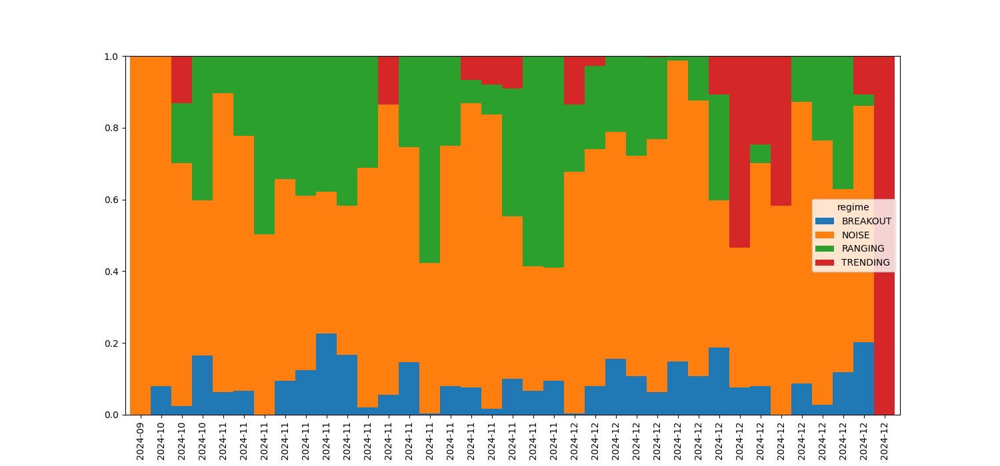

# Regime Analysis Report
Run Time: 2026-04-22 14:55:37

## Methodology
Classification via Hurst (300), ADX(14), ATR Ratio (14/100), BB Width Percentile (100).

## Regime Distribution

| Regime | Bar Count | % of Data |
|---|---|---|
| RANGING | 2371 | 23.71% |
| TRENDING | 602 | 6.02% |
| BREAKOUT | 878 | 8.78% |

## Statistical Test Results
| Regime | ADF p-val | ADF Stationary? | Ljung-Box p | Hurst Avg | Perm Entropy | JB p-val |
|---|---|---|---|---|---|---|
| RANGING | 0.0849 | NO | 0.7918 | 0.4227 | 0.9713 | 0.0000 |
| TRENDING | 0.1396 | NO | 0.8728 | 0.5924 | 0.9693 | 0.0000 |
| BREAKOUT | 0.1398 | NO | 0.7736 | 0.4353 | 0.9683 | 0.0000 |

### RANGING — Feature Rankings
| Feature | IC 1-bar | IC 5-bar | ICIR | Direction | Strength |
|---|---|---|---|---|---|
| bollinger_pB | -0.0461 | -0.0588 | -0.5579 | contrarian | strong |
| ema_diff | -0.0461 | -0.0588 | -0.5579 | contrarian | strong |
| rsi | -0.0344 | -0.0489 | -0.5188 | contrarian | strong |
| macd_hist | -0.0302 | -0.0341 | -0.4080 | contrarian | strong |
| rsi_momentum | -0.0121 | -0.0189 | -0.3727 | contrarian | neutral |
| atr_norm | 0.0223 | 0.0522 | 0.1788 | neutral | weak/dead |
| bb_width | 0.0042 | 0.0176 | -0.0235 | neutral | weak/dead |
| volatility | 0.0061 | 0.0109 | -0.0192 | neutral | weak/dead |

### TRENDING — Feature Rankings
| Feature | IC 1-bar | IC 5-bar | ICIR | Direction | Strength |
|---|---|---|---|---|---|
| rsi | -0.0003 | -0.0099 | -0.5833 | contrarian | strong |
| rsi_momentum | 0.0160 | 0.0206 | -0.3706 | contrarian | neutral |
| ema_diff | 0.0232 | 0.0274 | -0.3594 | contrarian | neutral |
| bollinger_pB | 0.0232 | 0.0274 | -0.3594 | contrarian | neutral |
| bb_width | -0.0463 | -0.1209 | 0.3233 | directional | neutral |
| macd_hist | 0.0489 | 0.0732 | -0.3003 | contrarian | neutral |
| atr_norm | -0.0307 | -0.1247 | 0.2414 | directional | neutral |
| volatility | -0.0195 | -0.1090 | 0.2181 | directional | neutral |

### BREAKOUT — Feature Rankings
| Feature | IC 1-bar | IC 5-bar | ICIR | Direction | Strength |
|---|---|---|---|---|---|
| rsi | -0.0256 | -0.0185 | -0.3652 | contrarian | neutral |
| rsi_momentum | 0.0036 | 0.0582 | -0.2145 | contrarian | neutral |
| bb_width | 0.0107 | 0.0561 | 0.1567 | neutral | weak/dead |
| volatility | -0.0460 | -0.0861 | -0.1501 | neutral | weak/dead |
| macd_hist | -0.0001 | 0.0367 | -0.1019 | neutral | weak/dead |
| atr_norm | -0.0268 | -0.0565 | 0.0804 | neutral | weak/dead |
| ema_diff | -0.0136 | 0.0217 | -0.0639 | neutral | weak/dead |
| bollinger_pB | -0.0136 | 0.0217 | -0.0639 | neutral | weak/dead |

## Regime Score Table
| Regime | Signal Strength | Predictability | Data Volume | Pattern Score | Total Score |
|---|---|---|---|---|---|
| **RANGING** | 0.5449 | 0.0287 | 0.2371 | 0.6000 | **0.3626** |
| TRENDING | 0.4378 | 0.0307 | 0.0602 | 0.8000 | 0.3148 |
| BREAKOUT | 0.2455 | 0.0317 | 0.0878 | 0.4000 | 0.1837 |

## Verdict
**Best Regime: RANGING**
Based on the highest total score combining signal strength and predictability.

**Dead Features (top regime):** bb_width, volatility, atr_norm