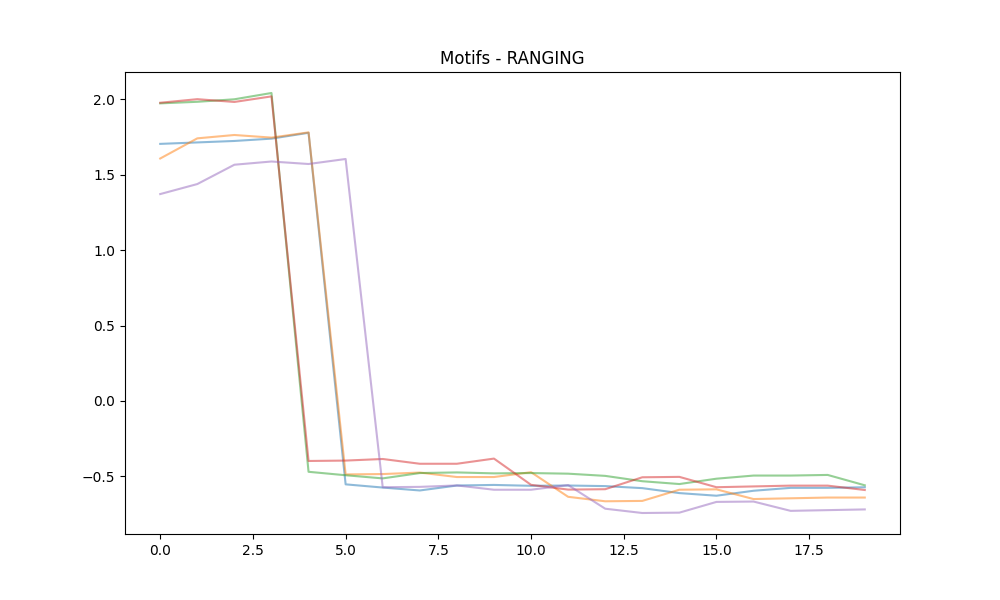
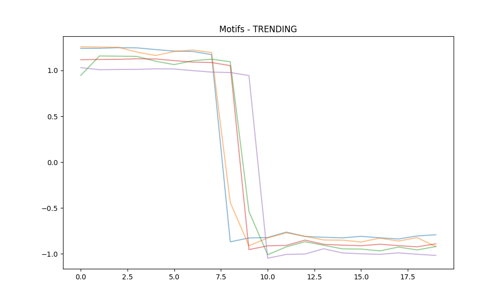
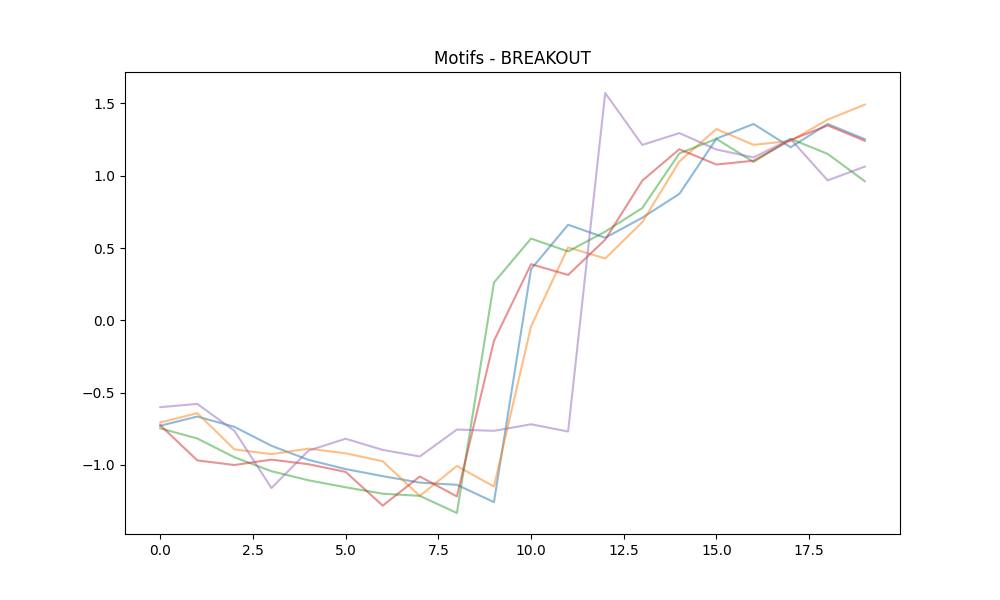
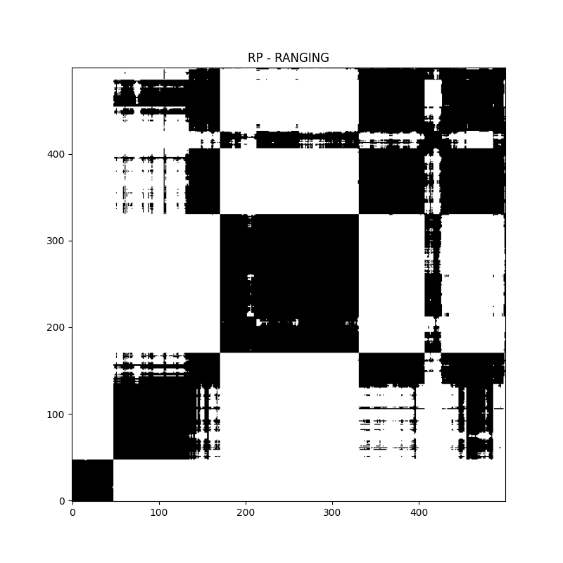
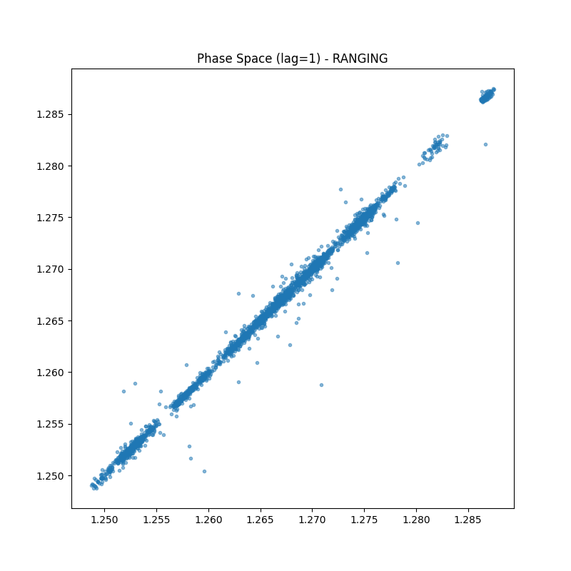
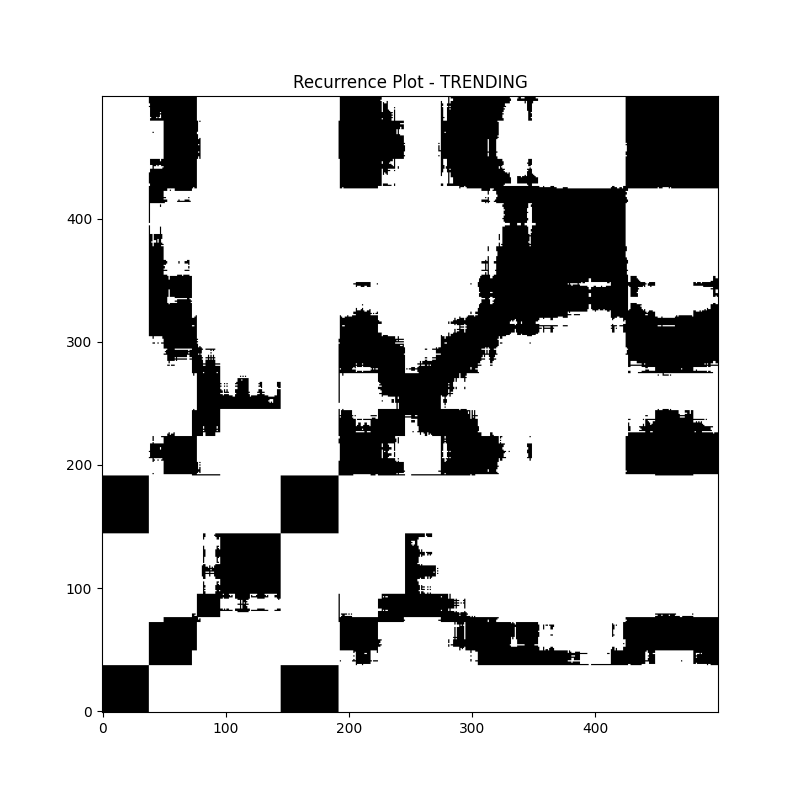
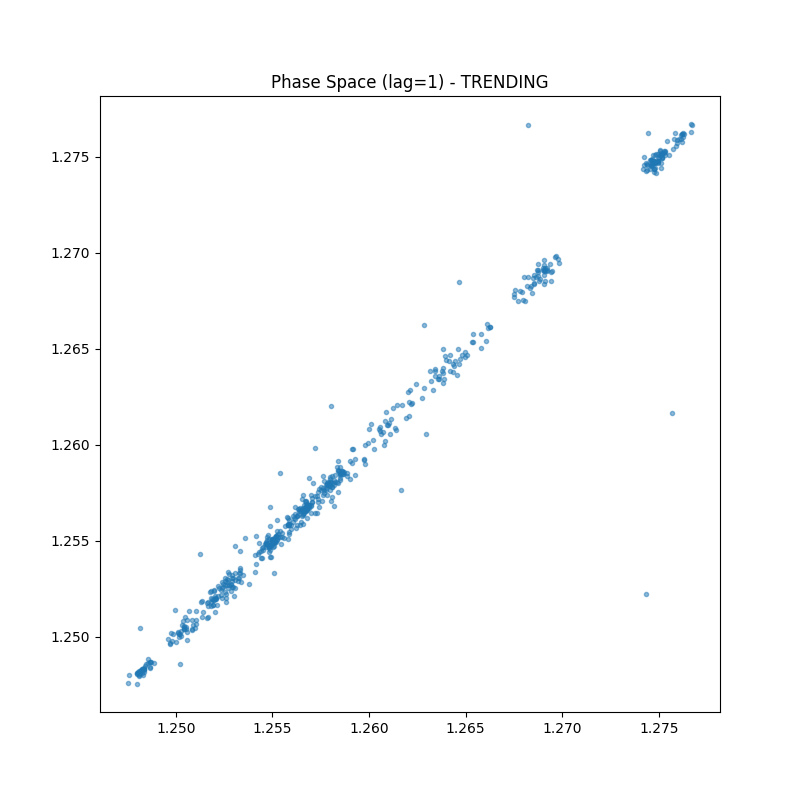
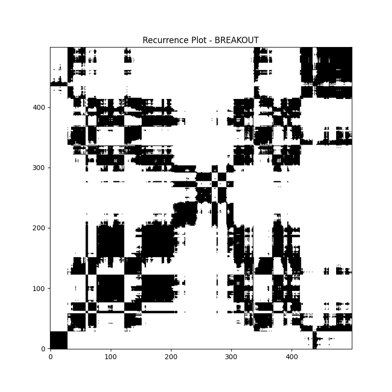
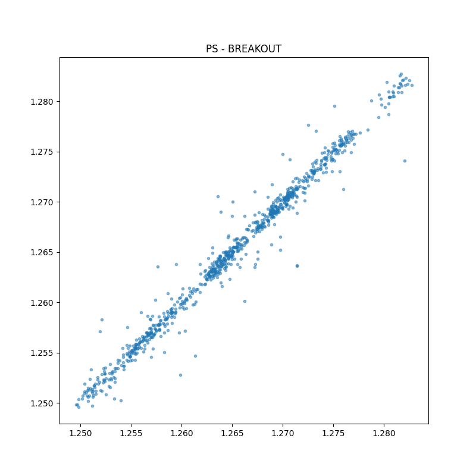

# Pattern Research Report
Run Time: 2026-04-21 13:06:58

## Matrix Profile Motifs
### RANGING

### TRENDING

### BREAKOUT

## Visual Interpretations
### RANGING
- **Recurrence Plot:** 
- **Phase Space:** 
### TRENDING
- **Recurrence Plot:** 
- **Phase Space:** 
### BREAKOUT
- **Recurrence Plot:** 
- **Phase Space:** 
