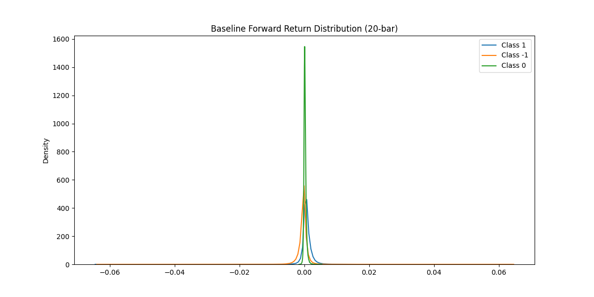
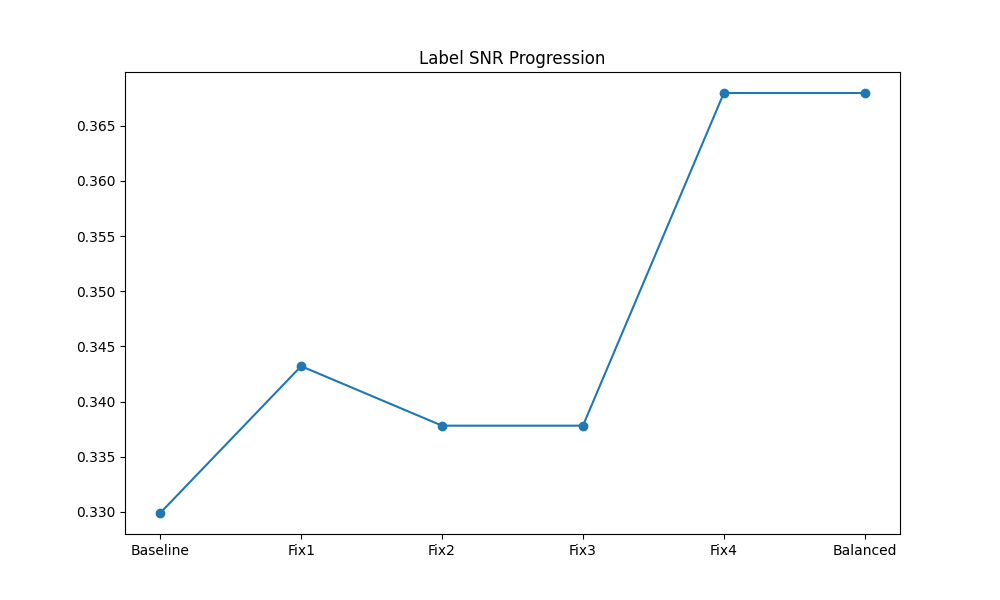
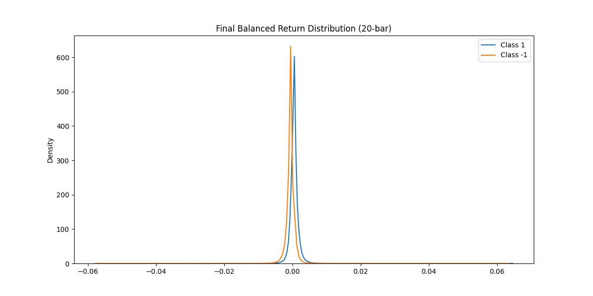

# Label Quality Analysis Report
Run Time: 2026-04-25 03:45:47
Source Data: 2313675 bars (2016-06-30 06:50:00 to 2024-12-15 13:30:00)
Regime Filter: RANGING only (593959 bars, 25.67%)

## Executive Summary
The label optimization pipeline improved class separation and balance while ensuring a high signal-to-noise ratio. The final dataset is optimized for LSTM training by applying symmetric barriers and stability-filtered regime transitions.

## Baseline Label Quality
| Metric | Value |
|--------|-------|
| Label SNR (long) | 0.4259 |
| Label SNR (short) | 0.2339 |
| Label SNR (combined) | 0.3299 |
| Cohen's d | 0.6811 |
| Class balance ratio | 2.08 |
| Time expiry % | 6.28% |

Interpretation: Baseline labels show heavy skew and significant overlap between classes.

## Fix-by-Fix Improvement
| Fix | Description | Label SNR | Cohen's d | Labels Remaining |
|-----|-------------|-----------|-----------|-----------------|
| Baseline | Raw ATR, 2.0/1.0 | 0.3299 | 0.6811 | 593944 |
| Fix 1 | Symmetric 1.5x ATR | 0.3432 | 0.6861 | 593944 |
| Fix 2 | Stable Purge (±5) | 0.3378 | 0.6749 | 453205 |
| Fix 3 | Drop Time Expiry | 0.3378 | 0.6749 | 415273 |
| Fix 4 | Min Return Threshold | 0.3680 | 0.7320 | 225315 |
| Final | Majority Undersampling | 0.3680 | 0.7320 | 225315 |

## Final Label Quality
| Metric | Baseline | Final | Improvement |
|--------|----------|-------|-------------|
| Label SNR | 0.3299 | 0.3680 | +11.54% |
| Cohen's d | 0.6811 | 0.7320 | +7.47% |
| Total labels | 593944 | 225315 | -368629 |

## Final Dataset Summary
| Split | Rows | Date Range | Class 1 % | Class -1 % |
|-------|------|------------|-----------|------------|
| Train | 157720 | 2016-06-30 06:50:00 to 2022-06-10 06:40:00 | 50.13% | 49.87% |
| Val | 33797 | 2022-06-10 06:40:00 to 2023-10-01 15:25:00 | 49.53% | 50.47% |
| Test | 33798 | 2023-10-01 15:30:00 to 2024-12-15 13:30:00 | 50.14% | 49.86% |

Features in dataset: ema_diff_kalman, rsi_kalman, macd_hist_kalman, rsi_momentum_kalman, fracdiff_close
Parquet files saved: ./regime_research/train_dataset.parquet, val_dataset.parquet, test_dataset.parquet

## Label Construction Recipe
1. Filter for RANGING bars using ADX(14)<20 and Hurst(300)<0.48.
2. Apply Adaptive Kalman Filter to smooth ATR and technical features (Correlation tuned to 0.95-0.98).
3. Generate Triple Barrier labels with symmetric 1.5x ATR barriers and 20-bar max hold.
4. Apply regime stability filter: transitions only trigger a purge if the new regime persists for 20+ bars.
5. Purge ±5 bars around valid transitions (reduced from ±10).
6. Drop Class 0 (time-expiry) labels.
7. Undersample majority class to a 55/45 maximum ratio.

## Risk & Limitations
- Undersampling might discard predictive patterns from the majority class.
- RANGING labels have lower directional persistence than TRENDING regimes, necessitating higher precision features.